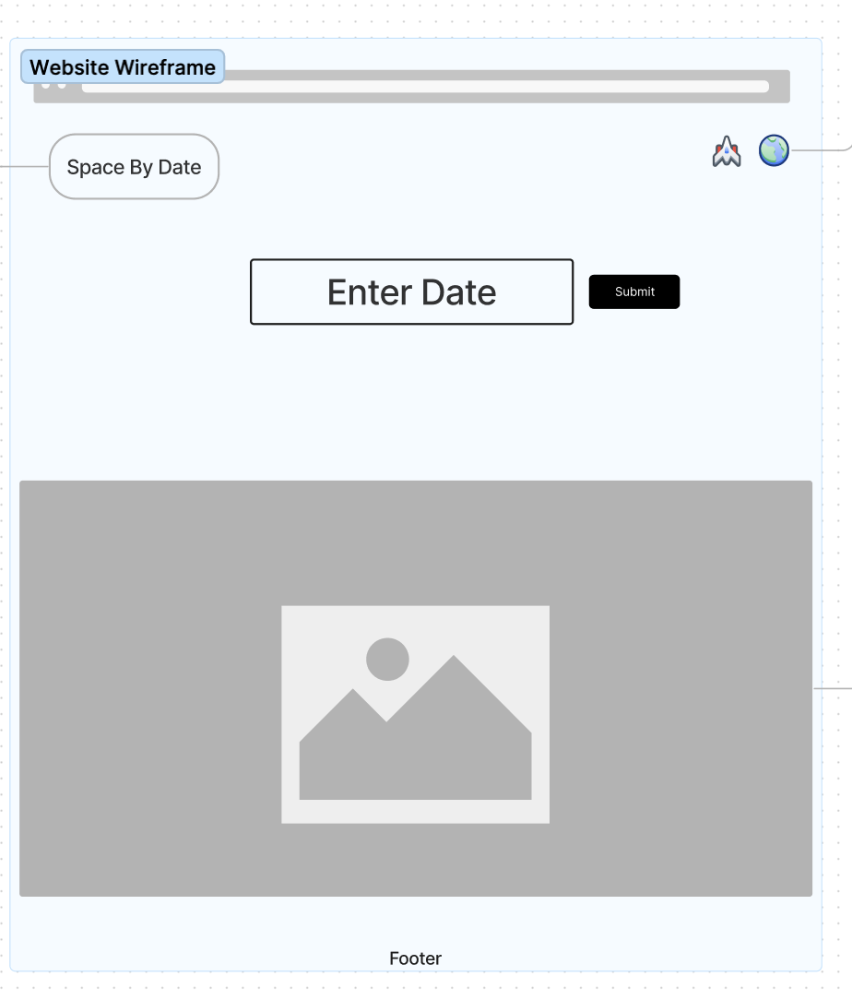

# NASA APOD App

## Description
Space by Date
- A simple web app that allows users to see the NASA APOD based off submitted date. 

## Technologies Used
* HTML5
* CSS3
* JavaScript/jQuery
* NASA APOD Database API
* Git/Github 
* Github Pages for Hosting
* Google Fonts

## Screenshots

### Wireframe

### Production Version

## Getting started

[Click Here](https://christendd.github.io/Project-1-NASA/) to visit the deployed app!

## Future Enhancements 

- Adding a feature that allows users get information about photo shown
- Adding an options for users to compare photos based off 2 or more dates selected